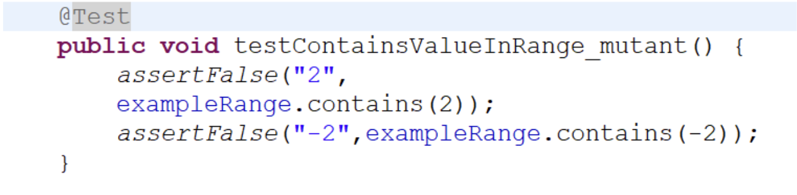
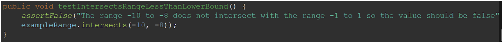
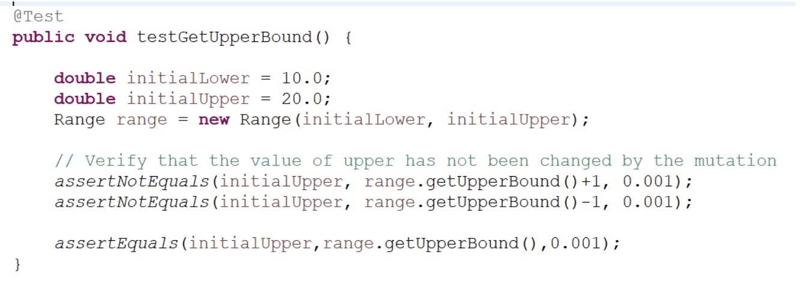
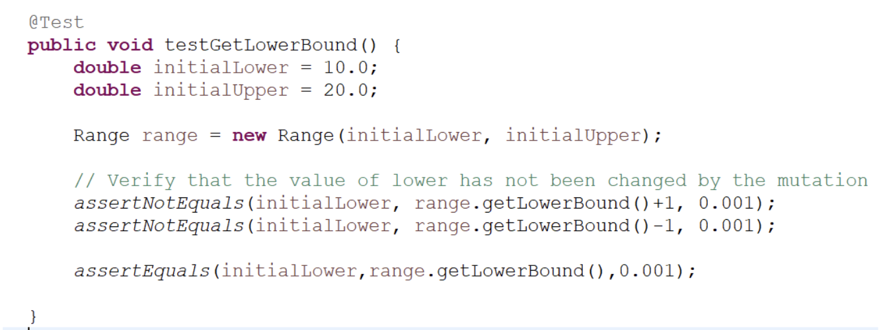
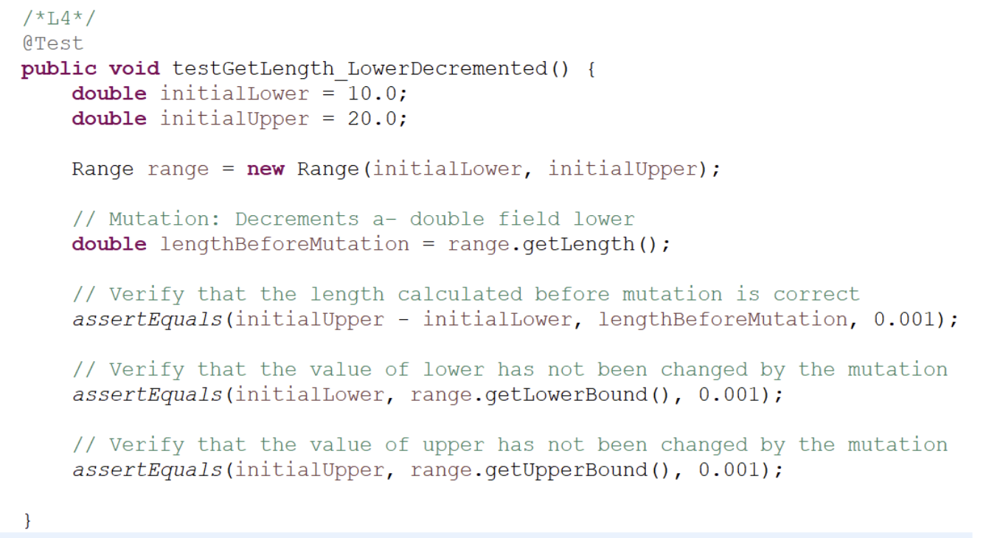
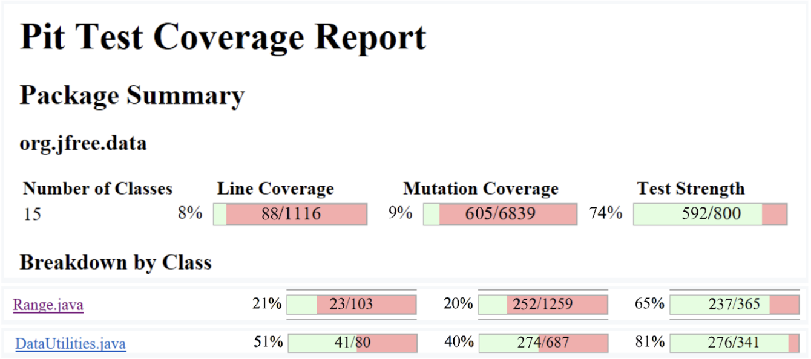
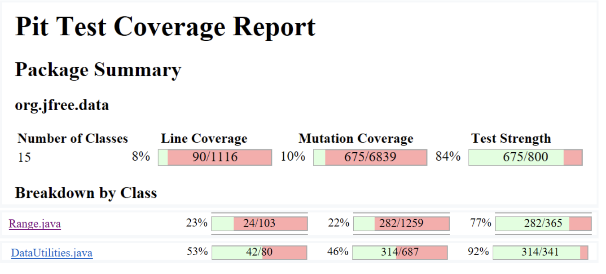

<strong>Analysis of at least 10 mutants produced by Pitest for the <code>Range</code> class, and how they are killed or not by your original test suite:</strong>

1. Intersects(double b0, double b1)

    Mutation: Negated Conditional (Killed)

    The condition “if(b0 &lt;= this.lower)” is replaced with “if(b0 > this.lower)”. This means that in the test cases, when b0 was passed through the condition with a value that was less than or equal to this.lower, the subsequent lines of the intersects function resulted in an incorrect value to be returned.

2. public double constrain(double value) 

    Mutation: Removed conditional, replaced equality check with False (Killed)

    This mutation tested the code by replacing the conditional check of if (!contains(value)) to always evaluate to false. This mutation was caught and killed since this mutation led to none of the test cases passing the condition check and therefore could not pass our test cases. The mutation was caught and was killed. 

3. Range(double lower, double upper)

    Mutation: Negated double local variable number 1 (Killed)

    This mutant is killed because it is identified as a fault. It leads to incorrect behaviour where lower is greater than upper which violates the class logic and throws an IllegalArgumentException. The test suite is able to detect this issue and therefore the mutation is killed.

4. Double getLength() 

    Mutation: replaced return of double value with -(x+1) (Killed)

    This mutant changed the code return this.upper - this.lower into -(return this.upper - this.lower + 1). This mutation fundamentally changes the logic of this method and therefore causes unexpected behaviour. This behaviour is easily caught by the test suite, meaning the mutation is killed. 

5. Double getCentralValue()

    Mutation: Replace double division with multiplication (Killed)

    In this scenario, the mutant changed return this.lower / 2.0 + this.upper / 2.0 by replacing the division operators by multiplications. This mutant was obviously caught by the test cases as by changing the math behind finding the central value you will never obtain the real central value. By changing the divisions to multiplication, we experienced incorrect behaviour which was detected by the tests.

6. Boolean containsDoubleValue(double value) LINE 144:3

    Mutation: decremented - - a double local variable number 1 (Survived)

    This mutation survived as we had not tested our edge cases thoroughly by doing a BLB and AUB test. This mutant was working as we never ensured that if we passed in a value above the upper bound, it would fail. But because it was being decremented, it would pass our original tests without any issues. By adding a new test, we ensured that any mutants of this nature would get caught and die.

7. intersects(double b0, double b1) 

    Mutation: Removed Conditional, replaced comparison check with false (Survived)

    This mutation survives because the test suite did not for the false outcome. The mutation removes the condition at line 161 and replaces it with false, eliminating the possibility of the outcome being true. By always returning false, regardless of input, the function disregards any conditions for intersection and instead asserts there is never an intersection between ranges. The following test was added to kill this mutation in our update test suite

8. Double getUpperBound()

    Mutation: Incremented (a++) double field lower (Survived)

    The mutation initially survived for the getUpperBound() function in our original test suite. Our tests did not account for the incremented mutation in our asserts. 

9. Double getLowerBound()

    Mutation: Negated double field Lower (Survived)

    Initially in our test suite there was no way to catch mutants that would alter/flip the value of getLowerBound. This meant that this mutation would survive, however due to our new test, we ensure that no mutants of this nature make it through as they are caught and killed. 

10. Double getLength() 

    Mutation: Decrements a– double field lower (Survived)

    This mutant survives as our initial test suite did not test to ensure our lower and upper bounds stayed unchanged after running the getLength() method. This made it so by using a postfix operator (ex. x++ or x–), the proper length would get returned (meaning all our tests would pass), but our bounds would be altered. By writing a new test that checks the integrity of our upper and lower bounds after calling the getLength() method, we can catch and kill this mutant. 

    

>>>>>  gd2md-html alert: inline image link here (to images/image5.png). Store image on your image server and adjust path/filename/extension if necessary.  (<a href="#">Back to top</a>)(<a href="#gdcalert6">Next alert</a>) >>>>> 

**All the statistics and the mutation score for each of the mutated classes (<code>Range</code> and <code>DataUtilities</code>) with each test suite class (original and the updated one):</strong>

**Original**

>>>>>  gd2md-html alert: inline image link here (to images/image6.png). Store image on your image server and adjust path/filename/extension if necessary.  (<a href="#">Back to top</a>)(<a href="#gdcalert7">Next alert</a>) >>>>> 

>>>>>  gd2md-html alert: inline image link here (to images/image7.png). Store image on your image server and adjust path/filename/extension if necessary.  (<a href="#">Back to top</a>)(<a href="#gdcalert8">Next alert</a>) >>>>> 

>>>>>  gd2md-html alert: inline image link here (to images/image8.png). Store image on your image server and adjust path/filename/extension if necessary.  (<a href="#">Back to top</a>)(<a href="#gdcalert9">Next alert</a>) >>>>> 

**Updated**

>>>>>  gd2md-html alert: inline image link here (to images/image9.png). Store image on your image server and adjust path/filename/extension if necessary.  (<a href="#">Back to top</a>)(<a href="#gdcalert10">Next alert</a>) >>>>> 

>>>>>  gd2md-html alert: inline image link here (to images/image10.png). Store image on your image server and adjust path/filename/extension if necessary.  (<a href="#">Back to top</a>)(<a href="#gdcalert11">Next alert</a>) >>>>> 

>>>>>  gd2md-html alert: inline image link here (to images/image11.png). Store image on your image server and adjust path/filename/extension if necessary.  (<a href="#">Back to top</a>)(<a href="#gdcalert12">Next alert</a>) >>>>> 

**# Analysis drawn on the effectiveness of each of the test classes**

Range:

Comparing our mutation scores from the original Range test set (from Assignment 3) to our new mutation scores with our new test cases, we can see an increase of 12%. This satisfies the required 10% increase as described in the lab manual. At a mutation test score of 77%, our test set is quite strong and reliability tests our softwares requirements. However, there is still room for improvement. Out of 365 mutants, we killed 282 while a total of 83 mutants survived.

DataUtilities:

Our original DataUtilities class had quite a solid mutation score of 81%. Because of this already high score, it was very difficult for us to increase it any more. Comparing our mutation scores from the original test set (from Assignment 3) to our updated mutation scores, we can see an increase of 11%. Out of 341 mutants, 314 mutants were caught and killed while a total of 27 mutants survived.

**A discussion on the effect of equivalent mutants on mutation score accuracy including a discussion on how equivalent mutants could be detected:**

Equivalent mutants, which do not affect program behavior but falsely inflate mutation scores, pose a challenge in mutation testing by providing misleading indications of test suite effectiveness. This can lead to a false sense of security and misallocation of resources in testing efforts.  Detecting equivalent mutants requires a combination of automated techniques and manual inspection. One approach is to use static analysis tools to analyze the mutated code and identify patterns indicative of equivalence with the original code. Additionally, dynamic analysis involves executing the test suite against mutants to determine if they produce the same behavior as the original code. However, dynamic analysis alone may not be sufficient, especially if the test suite does not adequately cover certain code paths. Mutation analysis tools can incorporate strategies to detect and filter out equivalent mutants during mutation testing by implementing sophisticated mutation operators.. Manual inspection, involving reviewing mutation reports and inspecting code changes introduced by mutants, can also help identify equivalent mutations that may have been missed by automated techniques. This ensures more reliable mutation testing results and meaningful insights into test suite effectiveness.

**A discussion of how you improved the mutation score of the test suites. Your design strategy:**

Our strategy was running the PIT analysis and visually identifying functions that had many mutations surviving as well as mutations that were affecting many of our methods. Once these were identified, we tried to tackle them one by one starting off by the easier to kill mutants. We wrote basic test cases that would ensure that all mutant conditions would be tested so mutants would be detected and killed. This strategy worked well for us as it permitted us to work as a pair to identify and solve each survivor one by one. This problem solving strategy was efficient and led us to our goal of increasing the mutation scores of our two test suites. 

**A discussion on the advantages and disadvantages of mutation testing:**

Mutation testing is a software testing technique that is used to evaluate the strength of test suites. By mutating the codebase, and then running the test suite against it, developers are able to evaluate the quality of their test suite and its ability to detect bugs. This improves the confidence of the test suite and its use in unit and regression testing. This is advantageous in system development to help detect bugs and minimize the likelihood of issues surfacing in production. 

This process does pose disadvantages in terms of the overhead required to execute the process. The process of mutation testing requires use of software tools and additional computing power to run the mutated code against the test suite and test its effectiveness. This can be disadvantageous in projects or applications with limited scope and budget with regards to testing. 

**Selenium Test case design process:**

We isolated some of the core functionalities of ebay as a shopping application. This includes login, the checkout, the adding and removing from cart functionality, the watchlist, the browsing separation by categories, the change language of the site functionality and the search functionality. We decided to automate the process of executing those functions on the site. Most of those functionalities did not require invalid data, except for the login functionality which we tested with an invalid and valid user. 

**Dependence of tests: **

To isolate and test some of the functionalities of the web application, there is a precondition that must be fulfilled. The test suite in Selenium is ordered in a way that the tests run and the precondition is fulfilled by the test case before it. Otherwise, the tests can be run as long as the precondition is fulfilled. Another note on the tests is that the items that are added to cart must have the button available for the script to run, so the item must not be a bid item. 

**UI Test Case Design Plan:**

<table>
  <tr>
   <td><strong>Functionality Under Test </strong>
   </td>
   <td><strong>Precondition</strong>
   </td>
   <td><strong>Sequence of Events </strong>
   </td>
   <td><strong>Expected Outcome</strong>
   </td>
  </tr>
  <tr>
   <td>Add to watchlist
   </td>
   <td>User is on the Ebay homepage
   </td>
   <td>
<ol>

<li>User selects an item

<li>User clicks add to watchlist button
</li>
</ol>
   </td>
   <td>Item is added to the users watchlist
   </td>
  </tr>
  <tr>
   <td>Login
   </td>
   <td>User is on the Ebay homepage
   </td>
   <td>
<ol>

<li>User clicks the sign in button

<li>User clicks continue with google

<li>User chooses their desired google account
</li>
</ol>
   </td>
   <td>User signs in successfully
   </td>
  </tr>
  <tr>
   <td>Add to Cart
   </td>
   <td>User is on the Ebay homepage
   </td>
   <td>
<ol>

<li>User clicks on a product to view details

<li>Users clicks the “Add to cart button”

<li>User is redirected to their cart

<li>User clicks the cart icon to verify the item is in their cart
</li>
</ol>
   </td>
   <td>Item is successfully added to their cart
   </td>
  </tr>
  <tr>
   <td>Remove an item from the cart
   </td>
   <td>User is on the Ebay homepage and has an existing item in their cart 
   </td>
   <td>
<ol>

<li>User clicks the cart icon to view their cart

<li>User clicks the remove button on the product

<li>User clicks the cart icon to verify that the product was removed from their cart
</li>
</ol>
   </td>
   <td>Item is successfully removed from their cart
   </td>
  </tr>
  <tr>
   <td>Search
   </td>
   <td>User is on the Ebay homepage
   </td>
   <td>
<ol>

<li>User clicks on the search bar

<li>User enters a search term 

<li>User clicks the search button
</li>
</ol>
   </td>
   <td>Results for users search are displayed
   </td>
  </tr>
  <tr>
   <td>Browse through categories
   </td>
   <td>User is on the Ebay homepage
   </td>
   <td>
<ol>

<li>User hovers on a category they wish to view.

<li>User selects a sub category from the list
</li>
</ol>
   </td>
   <td>User is brought to the subcategories page
   </td>
  </tr>
  <tr>
   <td>Change language
   </td>
   <td>User is on the Ebay home page
   </td>
   <td>
<ol>

<li>User hovers over their current language

<li>User selects a new language from the dropdown
</li>
</ol>
   </td>
   <td>Language of the website is changed
   </td>
  </tr>
  <tr>
   <td>Checkout cart
   </td>
   <td>Users shopping cart is not empty
   </td>
   <td>
<ol>

<li>User clicks on the cart icon

<li>User clicks the checkout button
</li>
</ol>
   </td>
   <td>Users items that they added to their cart are shown
   </td>
  </tr>
</table>

**Sample Data:**

<table>
  <tr>
   <td><em>Username</em>
   </td>
   <td>n0805763@gmail.com
   </td>
  </tr>
  <tr>
   <td><em>Password</em>
   </td>
   <td>thisisapassword:1234
   </td>
  </tr>
</table>

**Defects:** 

We found no defects in our testing of the Ebay site. This is likely because the UI is a core functionality of the platform, and tests are run thoroughly before releasing any bug fixes, making the site stable. 

**Advantages and Disadvantages of Selenium vs. Sikulix:**

<table>
  <tr>
   <td><strong>Selenium</strong>
   </td>
   <td><strong>Sikulix</strong>
   </td>
  </tr>
  <tr>
   <td>Pros:
   </td>
   <td>Pros:
   </td>
  </tr>
  <tr>
   <td>
<ul>

<li>Easy to use 

<li>Recording functionality simple to use for web applications in GUI testing

<li>Simple to add verification of elements in the test script

<li>Simple to install using chrome extension
</li>
</ul>
   </td>
   <td>
<ul>

<li>More flexibility to write code in your scripts

<li>Run can be slowed down using slow motion 

<li>Image based for UI’s that are stable or have expected image outputs

<li>Image recognition automation
</li>
</ul>
   </td>
  </tr>
  <tr>
   <td>Cons:
   </td>
   <td>Cons:
   </td>
  </tr>
  <tr>
   <td>
<ul>

<li>Tests are executed based on click location - difficult if elements change on UI (i.e. some ebay items require bids rather than checking out in carts - this affects the execution of the test case)

<li>Selenium IDE does not have the programming capabilities to add asserts, etc. in Java language
</li>
</ul>
   </td>
   <td>
<ul>

<li>More difficult to use for the average user to create and execute tests

<li>Requires running a jar file, rather than an extension for chrome

<li>Learning curve required to understand how to use the software - not intuitive

<li>Low automation/automatic test capture
</li>
</ul>
   </td>
  </tr>
</table>

**How team work was divided/managed:**

We used pair programming and split the lab activities amongst our pairs. Each pair worked on their individual parts by doing driver/passenger pair programming. Our pairs got together and compiled the work together for submission of the lab. 

**Difficulties encountered, challenges overcome, and lessons learned**

The biggest difficulties we encountered were setting up pitest as well as understanding what it was doing. However, using some online documentation like [https://pitest.org/quickstart/mutators/](https://pitest.org/quickstart/mutators/) helped us understand what each mutation was doing. We learned how mutation testing is beneficial and how to properly conduct it in a software testing environment. 

**Comments/feedback on the lab itself**

The instructions of the lab were confusing to us. It took us a long time just to be able to set up the testing environment to get pitest to just run. This was quite frustrating and time consuming for no reason other than a lack of/very poor explanations.  
